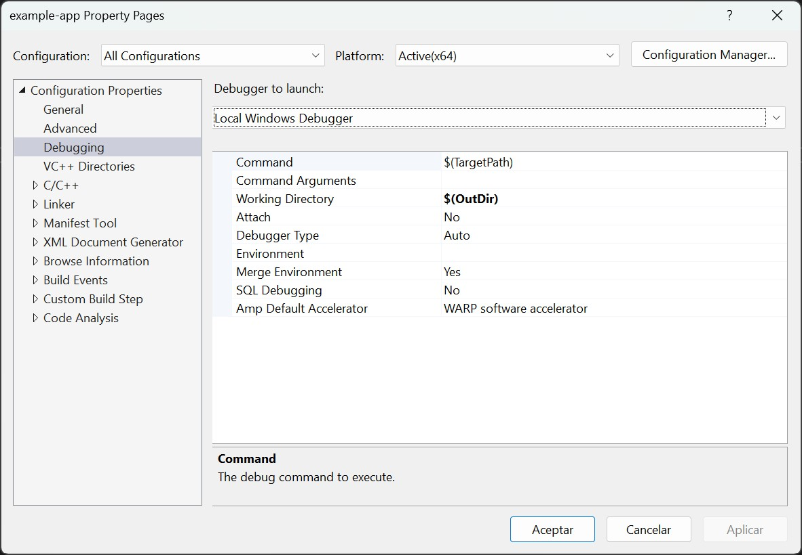

# bg2 engine - C++ API

bg2e is a graphic engine oriented to the creation of graphic applications. It is designed to cover some features that graphic engines for videogames do not have:

- Native integration with operating system APIs, especially with user interface elements.
- Load and store scenes and 3D models at runtime: no need to pack the scenes together with the executable application.
- Lightweight libraries: you don't need to distribute hundreds of megabytes of resources with the application.

## Requirements

You need to install Vulkan SDK, and during the installation, make sure you also install the following packages:

- GLM
- SDL2
- Vulkan Memory Allocator

If you have not installed Vulkan with these options, please reinstall.

The minimum Vulkan version required is 1.3.290. If you are using macOS, pay special attention to the Vulkan configuration part.

You will also need the development tools specific for your operating system:

- macOS: Xcode 15.0 or higher
- Windows: Visual Studio 2022 with the C++ development tools.

## Configuration

### macOS

On macOS the configuration of Vulkan is a bit special, as on this platform there is no concept of a system or user environment variable. Environment variables only work for command line applications, so you have to set the paths to Vulkan manually.

However, if you install VulkanSDK in your user folder (which is the default installation location) you won't have to make many changes.

In the project configuration, check that the `VULKAN_SDK` setting corresponds with the location of your VulkanSDK installation. If you have instaled a different version of Vulkan, you can change here this setting:

- VULKAN_SDK Default value: `$(HOME)/VulkanSDK/1.3.290.0/macOS`

### Windows

On Windows there is no special configuration to do, apart from installing Visual Studio 2022 and Vulkan SDK. But to run the code from Visual Studio you have to modify the working directory in the project options (Debugging > Workind Directory) to be the output directory (`$(OutDir)`)

