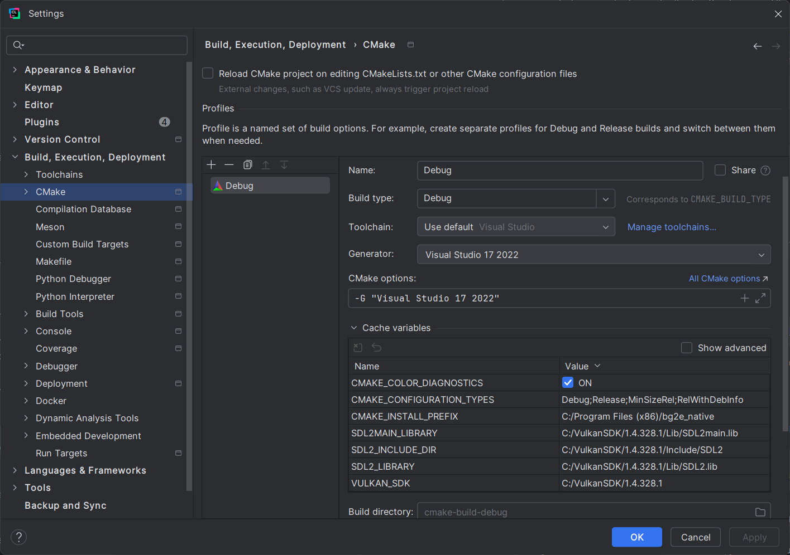

# bg2 engine - C++ API

bg2e is a graphic engine oriented to the creation of graphic applications. It is designed to cover some features that graphic engines for videogames do not have:

- Native integration with operating system APIs, especially with user interface elements.
- Load and store scenes and 3D models at runtime: no need to pack the scenes together with the executable application.
- Lightweight libraries: you don't need to distribute hundreds of megabytes of resources with the application.

## Requirements

### All platforms

bg2 engine depends on **SDL2**, **Vulkan**, and **GLM**, but the way these dependencies are satisfied depends on the platform chosen for the build.

### macOS and Windows

During the VulkanSDK installation, ensure you also install the following packages:

- GLM
- SDL2
- Vulkan Memory Allocator

Además necesitarás:

- En macOS: Xcode, la versión adecuada para tu sistema operativo, como mínimo la versión 15.
- En Windows: Visual Studio 2022, instalando los paquetes de desarrollo de escritorio para C++.
- En ambas: CMake v3.18 o superior.

### Linux

On Linux, install the required packages using your distro package manager:

```sh
$ sudo apt update
$ sudo apt install libsdl2-dev libgtk-3-dev libglm-dev
```

To install VulkanSDK in Linux, [download it from the website](https://vulkan.lunarg.com/sdk/home) and extract it. Yoy can place the VulkanSDK directory in any place, for example, in your home directory:

```sh
~/vulkan_sdk/1.x.xxx
```

The directory with the Vulkan version number contains a script named `setup-env.sh`. Add this script to the file `~/.bashrc` or similar (depending on the shell you use) so that the environment variables are registered:

**.bashrc**

```sh
...
source ~/vulkan_sdk/1.4.313/setup-env.sh
```

In addition to the development packages, you will also need to install **clang**, **llgb** (if you want to debug), **cmake**, and **ninja-build**:

**Example for Debian/Ubuntu:**

```sh
$ sudo apt update
$ sudo apt install clang lldb cmake ninja-build
```


## Building

The only variable required to configure the project is `VULKAN_SDK`.
By default, this value is obtained directly from the `$VULKAN_SDK` environment variable, which is automatically set when the Vulkan SDK is correctly installed on the system.

If the environment variable is not defined or the SDK is installed in a non-standard location, VULKAN_SDK can be configured manually when invoking CMake.

**Example: Passing VULKAN_SDK manually to CMake in Linux**

```sh
$ cmake -S . -B build -G Ninja -DVULKAN_SDK=/path/to/vulkan/sdk
```

Replace /path/to/vulkan/sdk with the actual installation path of the Vulkan SDK on your system, and replace the generator with the correct one for your platform (as explained below).

### macOS

On macOS, the project must be generated using Xcode as the CMake generator.
When using Ninja or Unix Makefiles, the application will build correctly, but native file selection dialogs will not function properly at runtime. This is due to the way macOS integrates GUI applications with the system frameworks and application bundles, which requires an Xcode-generated build.

For this reason, Xcode is the only supported generator on macOS for this project.

**Example: Generating and building the engine on macOS**

```sh
$ cd bg2e-native
$ cmake -S . -B ./build -G Xcode
$ cmake --build build
```

This will generate an Xcode project, build the engine, and produce a properly bundled macOS application with fully functional file dialogs.

### Windows

On Windows, the project must be generated using Visual Studio 17 as the CMake generator.
Using Ninja or Ninja Multi-Config is not supported and will result in incorrect runtime behavior, as the build system relies on Visual Studio–specific integration for proper configuration and execution.

For this reason, Visual Studio 17 is the only supported generator on Windows for this project.

**Example: Generating and building the engine on Windows**

```sh
cd bg2e-native
cmake -S . -B ./build -G "Visual Studio 17 2022"
cmake --build ./build
```

> Note: Other versions of Visual Studio may work as long as they fully support C++20, but they have not been tested and are therefore not officially supported.

### Linux

On Linux, the project has been developed and tested exclusively using Ninja as the CMake generator.
This generator is recommended for development and is known to work correctly with the toolchain and runtime configuration used by the engine.

Other CMake generators (such as Unix Makefiles) may also work, but they have not been tested and are therefore not officially supported.

**Example: Generating and building the engine on Linux**

```sh
$ cd bg2e-native
$ cmake -S . -B build -G Ninja
$ cmake --build build
```

This will generate the build files using Ninja and compile the engine using parallel builds by default.

### Bonus: CLion

The engine is primarily developed using CLion, an IDE by JetBrains.
CLion can be used free of charge for open-source, non-commercial projects, which makes it a convenient choice for engine development.

**macOS**

On macOS, CLion should be configured to use Ninja as the CMake generator in order for code completion, indexing, and code inspection to work correctly. Using Xcode as the generator inside CLion will significantly degrade these IDE features.

However, when testing native macOS file dialog APIs, the generator must be switched to Xcode, as those dialogs will not function correctly with Ninja-based builds. In practice, this means alternating the generator depending on whether you are developing or testing platform-specific UI behavior.

**Windows**

On Windows, CLion must use Visual Studio 17 as the CMake generator, following the same requirements described in the Windows build section above. Other generators are not supported and may result in incorrect behavior.

**Linux**

On Linux, development has been tested using Ninja, which is the recommended generator. Other generators may also work, but they have not been tested and are therefore not officially supported.

**Configuring VULKAN_SDK in CLion**

On Linux and macOS, CLion does not automatically inherit the VULKAN_SDK environment variable in all configurations. As a result, the variable usually needs to be set manually inside the IDE.

The recommended process is:

- Open the project in CLion and let CMake configuration run.
- Allow the initial CMake configuration to fail due to VULKAN_SDK not being found.
- Open `Settings > Build, Execution, Deployment > CMake`.
- Expand the Cache variables section.



- Add or edit the VULKAN_SDK variable and set it to the correct Vulkan SDK installation path.
- Re-run CMake configuration.

Once configured, CLion will correctly detect Vulkan headers and libraries, and the project will configure and build normally.
