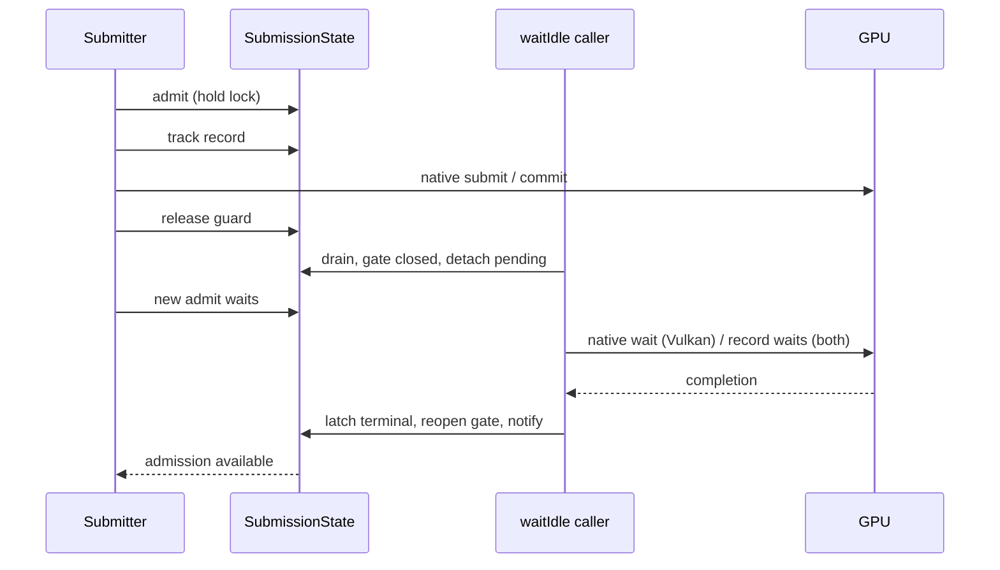

# Submission tracking and waitIdle implementation

This document explains bg2 engine's GPU completion tracking, complementing the public
[Device](Device.md), [Queue](Queue.md), [Surface](Surface.md) and
[CleanupManager](CleanupManager.md) contracts. Exact excerpts identify the source
file and line range. Internal types are implementation infrastructure, not
application-facing synchronization objects.

## Contract and why Metal needs a registry

`gpu::Device::waitIdle()` waits through a device-wide submission boundary.
Vulkan supplies vkDeviceWaitIdle; Metal supplies completion waiting on each
MTLCommandBuffer, without an equivalent general device wait. Metal therefore
must remember every wrapper submission, including nonpresentation/transfer work
and immediateSubmit, rather than waiting only for the last scene command.

Submission stays asynchronous. The implementation does not wait after each
ordinary Queue::submit and does not serialize GPU frames on the CPU. CPU waits
occur at occupied slot/acquired-image reuse, synchronous immediateSubmit and explicit lifecycle/
safe-update waits. A command can continue executing after its C++ wrapper is
released; completion records retain the native lifetime needed to observe it.

## Ownership and state layers

| Layer | Stored information | Lifetime / purpose |
|---|---|---|
| Device | shared SubmissionState | One registry/gate across its queue wrappers |
| Queue | same shared state, device and native queue identity | Admission and complete native submit transaction |
| CommandBuffer | recording/executable/submitted state, completion pointer, optional acquired frame | Validate recording/reuse; associate a send with a slot |
| CompletionRecord | poll/wait closures, cached terminal/error state, ID | One immutable submission identity despite wrapper/fence reuse |
| SurfaceFrame | vector of completion pointers | Wait all sends occupying a reused frame slot |
| CleanupManager entry | snapshot of completion pointers plus closure | Destroy retired resources when dependencies become terminal |

Device's state is protected; friend Queue/CleanupManager integration uses it.
The concrete backend initializes a new state for a new Device lifecycle and
passes it to graphics/present/transfer queues. Vulkan queue wrappers that alias
one native queue still use the same lock. Native submit/present calls are
serialized on the CPU; GPU execution is not held under that transaction lock.

## CompletionRecord: latch one submission

Source: [lib/include/bg2e/gpu/detail/SubmissionState.hpp](../../../lib/include/bg2e/gpu/detail/SubmissionState.hpp), lines 35–76. Exact excerpt:

```cpp
class BG2E_API CompletionRecord {
public:
    CompletionRecord(std::function<bool()> poll, std::function<void()> wait)
        : _poll(std::move(poll)), _wait(std::move(wait)) {}

    bool completed() {
        std::lock_guard lock(_mutex);
        if (!_terminal) {
            try { if (_poll()) finish(); }
            catch (...) { fail(std::current_exception()); }
        }
        if (_error) std::rethrow_exception(_error);
        return _terminal;
    }

    void wait() {
        std::lock_guard lock(_mutex);
        if (!_terminal) {
            try { _wait(); finish(); }
            catch (...) { fail(std::current_exception()); }
        }
        if (_error) std::rethrow_exception(_error);
    }

    // Submission failed before GPU admission; never wait on its native fence.
    void cancel(std::exception_ptr error) {
        std::lock_guard lock(_mutex);
        fail(error);
    }

    uint64_t id = 0;

private:
    void finish() { _terminal = true; _poll = {}; _wait = {}; }
    void fail(std::exception_ptr error) { _error = error; finish(); }
    std::mutex _mutex;
    bool _terminal = false;
    std::exception_ptr _error;
    std::function<bool()> _poll;
    std::function<void()> _wait;
};
```

The per-record mutex serializes polling, waiting and cancellation. `completed()`
is a GPU-status query, though it can block acquiring this mutex if another thread
is waiting on the same record. `wait()` calls the native wait at most once after
a successful terminal observation. finish clears the closures, releasing captured
native ownership. fail caches exception_ptr and marks terminal before doing the
same. Subsequent polls/waits rethrow the cached failure without consulting a
possibly reset fence. `cancel` represents a failure before native admission and
prevents waiting forever on a fence that was never signaled.

IDs increase under the registry lock and identify tracked submissions; they are
not timeline semaphore values, fences or ordering dependencies. The registry
does not add automatic synchronization between different GPU queues.

## SubmissionState: admission, tracking and snapshots

Source: [lib/include/bg2e/gpu/detail/SubmissionState.hpp](../../../lib/include/bg2e/gpu/detail/SubmissionState.hpp), lines 81–87. Exact excerpt:

```cpp
    std::unique_lock<std::mutex> admit() {
        std::unique_lock lock(_mutex);
        _changed.wait(lock, [&] { return !_draining; });
        if (_closed) throw std::logic_error("GPU device is closed to submissions");
        retire();
        return lock;
    }
```

Source: [lib/include/bg2e/gpu/detail/SubmissionState.hpp](../../../lib/include/bg2e/gpu/detail/SubmissionState.hpp), lines 90–93. Exact excerpt:

```cpp
    void track(const std::shared_ptr<CompletionRecord>& record) {
        record->id = ++_nextId;
        _pending.push_back(record);
    }
```

Source: [lib/include/bg2e/gpu/detail/SubmissionState.hpp](../../../lib/include/bg2e/gpu/detail/SubmissionState.hpp), lines 102–107. Exact excerpt:

```cpp
    std::vector<std::shared_ptr<CompletionRecord>> snapshot() {
        std::unique_lock lock(_mutex);
        _changed.wait(lock, [&] { return !_draining; });
        retire();
        return _pending;
    }
```

Admission waits until no drain is active, rejects a permanently closed device,
retires completed records, then returns the held unique_lock to the queue.
The queue must keep this guard through validation, registration and the native
submit (and Vulkan presentation). track/cancel rely on that held lock; they do
not lock again. Consequently drain cannot detach a record that has been
registered but has not completed its native submit transaction.

snapshot uses the same mutex and waits for a drain to finish before retiring and
copying pending records. It is used by deferred cleanup: it observes submitted
work up to that lock boundary, not recorded/unsubmitted commands or future
submissions. retire polls every pending record and erases completed ones.
If polling reports an error, admission/snapshot propagates it; only drain's error
path sets `_closed`. There is no background polling thread or completion-handler
queue in this implementation.

## Drain algorithm and synchronization boundary

Source: [lib/include/bg2e/gpu/detail/SubmissionState.hpp](../../../lib/include/bg2e/gpu/detail/SubmissionState.hpp), lines 109–109. Exact excerpt:

```cpp
    void drain(std::function<void()> nativeWait = {}
```

The exact sequence is:

1. Acquire registry mutex, wait for any other drain to finish, set draining,
   optionally set closed, and move pending records into a local vector.
2. Release mutex while keeping the admission gate logically closed.
3. Invoke an optional native device wait (Vulkan), recording its first failure.
4. Wait every detached record, even when earlier waits failed; preserve first error.
5. Reacquire mutex; errors permanently close admission, clear draining, then notify
   blocked submitters/snapshots/drains. Rethrow first failure after notification.



A concurrent submit is either admitted before this boundary and included, or
waits until gate reopening. waitIdle does not permanently freeze submission:
a waiting producer may submit immediately as the gate reopens, even before the
calling thread has resumed from waitIdle. To resize/destroy/mutate resources,
stop or coordinate producers before the call and keep them stopped through the
operation. The gate is not a resource-mutation critical section. It also does
not wait for unsubmitted commands being recorded by another CPU thread.
A native callback that recursively submits while drain is waiting could deadlock;
the internal wait closures only perform native waits/status checks.

`cleanup()` uses `drain(..., true)` to close admission for teardown. On wait
failure the state also becomes closed. Later admit calls throw rather than send
more work through a failed/closing device. Concurrent native device/resource
lifecycle operations still require owner coordination.

## Metal: retain each native command buffer and commit asynchronously

Source: [lib/src/bg2e/gpu/metal/Queue.cpp](../../../lib/src/bg2e/gpu/metal/Queue.cpp), lines 110–144. Exact excerpt:

```cpp
void Queue::submit(gpu::CommandBuffer* cmd) const
{
    if (!_submissions) throw std::logic_error("Metal queue has no device");
    auto admission = _submissions->admit();
    auto* command = dynamic_cast<metal::CommandBuffer*>(cmd);
    if (!command || command->_device != _device || !command->handle() ||
        command->handle()->commandQueue() != _commandQueue)
        throw std::invalid_argument("Metal command buffer belongs to another queue/device");
    if (command->_submitted || command->_recording || !command->_executable)
        throw std::logic_error("Metal command buffer is already submitted or not executable");
    auto* handle = command->handle();
    handle->retain();
    auto native = std::shared_ptr<MTL::CommandBuffer>(handle, [](MTL::CommandBuffer* value) { value->release(); });
    auto record = std::make_shared<detail::CompletionRecord>(
        [native] {
            auto status = native->status();
            if (status == MTL::CommandBufferStatusError)
                throw std::runtime_error("Metal command buffer execution failed");
            return status == MTL::CommandBufferStatusCompleted;
        },
        [native] {
            native->waitUntilCompleted();
            if (native->status() == MTL::CommandBufferStatusError)
                throw std::runtime_error("Metal command buffer execution failed");
        });
    try {
        _submissions->track(record);
        command->_completion = record;
        if (command->_submissionFrame) command->_submissionFrame->trackSubmission(record);
        handle->commit();
    }
    catch (...) { _submissions->cancel(record, std::current_exception()); throw; }
    command->_submitted = true;
    command->_executable = false;
}
```

Metal validation checks backend type, owning device, native command queue,
recording/executable state and prior submission. The native buffer is explicitly
retained and wrapped in shared_ptr with a release deleter. Both record closures
capture it. Poll checks status for Completed/Error; wait calls waitUntilCompleted
and checks Error. The current exception reports a generic execution failure,
without copying the native NSError details.

Registration precedes commit under admission. The command and optional acquired
frame retain the record; registry also owns it. A catch cancels/removes the record
if the transaction throws. After successful commit, submitted becomes true and
executable false. A Metal command buffer is one-shot; a later frame creates a new
wrapper/native command, with old wrappers retained until slot reuse is safe.
Queue::createCommandBuffer itself takes admission, so creation also blocks while
drain runs; actual recording is not covered by the device-wide guard.

Device wait and synchronous immediate submission use the same infrastructure:

Source: [lib/src/bg2e/gpu/metal/Device.cpp](../../../lib/src/bg2e/gpu/metal/Device.cpp), lines 107–110. Exact excerpt:

```cpp
void Device::waitIdle()
{
    if (_device) _submissions->drain();
}
```

Source: [lib/src/bg2e/gpu/metal/Device.cpp](../../../lib/src/bg2e/gpu/metal/Device.cpp), lines 217–225. Exact excerpt:

```cpp
void Device::immediateSubmit(std::function<void(gpu::CommandBuffer*)>&& function)
{
    auto command = _graphicsQueue.createCommandBuffer("Immediate submission");
    command->begin();
    function(command.get());
    command->end();
    _graphicsQueue.submit(command.get());
    static_cast<metal::CommandBuffer*>(command.get())->waitForCompletion();
}
```

The registry contains work from every queue initialized by Device, not only
commands associated with a SurfaceFrame. immediateSubmit routes through Queue,
then waits that command's completion; it does not drain unrelated queues.
Metal cleanup drains with close=true before releasing queues/device.
Calling commit directly through native handles bypasses this registry, so Metal
waitIdle cannot guarantee completion of such external sends. Interoperability
must submit through gpu Queue or explicitly coordinate outside this contract.

## Vulkan: native wait plus the same immutable completion records

Source: [lib/src/bg2e/gpu/vk/Device.cpp](../../../lib/src/bg2e/gpu/vk/Device.cpp), lines 312–320. Exact excerpt:

```cpp
void Device::waitIdle()
{
    if (_device == VK_NULL_HANDLE) return;
    _submissions->drain([this] {
        auto result = vkDeviceWaitIdle(_device);
        if (result != VK_SUCCESS)
            throw std::runtime_error("vkDeviceWaitIdle failed: " + std::to_string(result));
    });
}
```

Vulkan calls vkDeviceWaitIdle, inside the shared admission boundary.
Then the registry waits/latches each completion record, giving SurfaceFrame and
CleanupManager the same terminal state as Metal. cleanup closes the gate before
command-pool/allocator/device destruction. Native waits failing report the result
and close future admission through drain.

Queue::submit uses a frame's reusable fence for presentation or creates a
submission-owned fence for a nonpresentation command. It captures CommandAllocation
in both completion closures to keep VkCommandBuffer and its exclusive pool alive.
The owned fence has a deleter bound to VkDevice; resources must not outlive device
cleanup. Vulkan validation rejects commands from another queue/device, open
recording or an incomplete previous send. The present path allows one submit for
an acquired Vulkan frame, although generic slot tracking supports vectors.

Source: [lib/src/bg2e/gpu/vk/Queue.cpp](../../../lib/src/bg2e/gpu/vk/Queue.cpp), lines 116–134. Exact excerpt:

```cpp
    VkFence fence = presenting ? frame->inFlightFence() : VK_NULL_HANDLE;
    std::shared_ptr<VkFence> ownedFence;
    if (!presenting) {
        auto info = Info::fenceCreateInfo();
        check(vkCreateFence(_device, &info, nullptr, &fence), "vkCreateFence");
        ownedFence = std::shared_ptr<VkFence>(new VkFence(fence), [device = _device](VkFence* value) {
            vkDestroyFence(device, *value, nullptr); delete value;
        });
    }
    auto record = std::make_shared<detail::CompletionRecord>(
        [device = _device, fence, ownedFence, allocation = cmd->_allocation] {
            auto result = vkGetFenceStatus(device, fence);
            if (result == VK_NOT_READY) return false;
            check(result, "vkGetFenceStatus"); return true;
        },
        [device = _device, fence, ownedFence, allocation = cmd->_allocation] {
            check(vkWaitForFences(device, 1, &fence, VK_TRUE, UINT64_MAX), "vkWaitForFences");
        });
```

Source: [lib/src/bg2e/gpu/vk/Queue.cpp](../../../lib/src/bg2e/gpu/vk/Queue.cpp), lines 135–164. Exact excerpt:

```cpp
    try {
        _submissions->track(record);
        cmd->_completion = record;
        if (cmd->_submissionFrame) cmd->_submissionFrame->trackSubmission(record);
        if (presenting) {
            check(vkResetFences(_device, 1, &fence), "vkResetFences");
            auto wait = Info::semaphoreSubmitInfo(VK_PIPELINE_STAGE_2_ALL_COMMANDS_BIT, frame->imageAvailable());
            auto signal = Info::semaphoreSubmitInfo(VK_PIPELINE_STAGE_2_ALL_COMMANDS_BIT, frame->renderFinished());
            auto submit = Info::submitInfo(&info, &signal, &wait);
            check(queueSubmit2(_queue, 1, &submit, fence), "vkQueueSubmit2");
        } else {
            auto submit = Info::submitInfo(&info, nullptr, nullptr);
            check(queueSubmit2(_queue, 1, &submit, fence), "vkQueueSubmit2");
        }
    } catch (...) {
        _submissions->cancel(record, std::current_exception());
        throw;
    }
    cmd->_executable = false;
    // Presentation is in the same admission transaction as submission.
    if (presenting) {
        auto semaphore = frame->renderFinished();
        auto swapchain = frame->swapchain();
        auto index = frame->imageIndex();
        auto info = Info::presentInfo(swapchain, semaphore, index);
        auto result = queuePresent(_queue, &info);
        if (result == VK_ERROR_OUT_OF_DATE_KHR || result == VK_SUBOPTIMAL_KHR)
            frame->requestRecreate();
        else check(result, "vkQueuePresentKHR");
    }
```

The admission guard spans vkQueueSubmit2 and vkQueuePresentKHR. Frame submission
resets its fence, waits imageAvailable and signals renderFinished. Out-of-date or
suboptimal presentation marks recreation; other errors propagate. A presentation
error after successful submit leaves its completion tracked, because the GPU
send already happened. Nonpresentation submits use their own owned fence and
no presentation semaphores.

Vulkan command allocations use an exclusive pool per live allocation. Queue's
pool cache reuses a pool only when the cache owns the sole shared reference;
CommandAllocation plus record closures keep a pool unavailable while a command
is alive/in flight. Its mutex protects allocation/free/cleanup. This permits
recording distinct command buffers on distinct live pools without sharing one
externally synchronized VkCommandPool between recording threads.

Source: [lib/include/bg2e/gpu/vk/CommandPoolState.hpp](../../../lib/include/bg2e/gpu/vk/CommandPoolState.hpp), lines 28–53. Exact excerpt:

```cpp
struct CommandPoolState {
    std::mutex mutex;
    VkDevice device = VK_NULL_HANDLE;
    VkCommandPool pool = VK_NULL_HANDLE;

    ~CommandPoolState() { cleanup(); }

    void cleanup() {
        std::lock_guard lock(mutex);
        if (pool) vkDestroyCommandPool(device, pool, nullptr);
        pool = VK_NULL_HANDLE;
        device = VK_NULL_HANDLE;
    }
};

struct CommandAllocation {
    std::shared_ptr<CommandPoolState> pool;
    VkCommandBuffer command = VK_NULL_HANDLE;
    ~CommandAllocation() {
        if (!command) return;
        std::lock_guard lock(pool->mutex);
        if (pool->pool && command)
            vkFreeCommandBuffers(pool->device, pool->pool, 1, &command);
    }
};
```

Explicit pool cleanup nulls handles so surviving wrappers do not double-free.
It does not authorize using a wrapper after Device cleanup. Vulkan begin also
checks old completion before resetting a wrapper; errors reject reuse.

## Surface slots and reusable-fence correctness

SurfaceFrame privately tracks completion records through backend friends.
Association happens in Surface::present (or beginRendering(frame) in backend
paths); a successful Queue::submit adds the record to that associated frame.

Source: [lib/include/bg2e/gpu/SurfaceFrame.hpp](../../../lib/include/bg2e/gpu/SurfaceFrame.hpp), lines 49–60. Exact excerpt:

```cpp
    void trackSubmission(const std::shared_ptr<detail::CompletionRecord>& record) { _submissions.push_back(record); }
    bool hasSubmissions() const { return !_submissions.empty(); }
    void waitForSubmissions() {
        std::exception_ptr error;
        for (const auto& record : _submissions) {
            try { record->wait(); }
            catch (...) { if (!error) error = std::current_exception(); }
        }
        _submissions.clear();
        if (error) std::rethrow_exception(error);
    }
```

waitForSubmissions waits every associated send, clears the slot vector and
reports its first error. Metal beginFrame waits only the current ring slot, drops
its old frame, and requests nextDrawable. No drawable/zero size returns nullptr
without advancing the current slot/counter. The acquired SurfaceFrame retains
the drawable and wraps its texture.

Source: [lib/src/bg2e/gpu/metal/WindowSurface.cpp](../../../lib/src/bg2e/gpu/metal/WindowSurface.cpp), lines 125–143. Exact excerpt:

```cpp
std::shared_ptr<gpu::SurfaceFrame> WindowSurface::beginFrame()
{
    if (_currentFrame) throw std::logic_error("Metal surface already has an acquired frame");
    if (!_size.width || !_size.height || !_layer) return nullptr;
    auto& slot = _frames[_currentFrameIndex];
    if (slot) slot->waitForSubmissions();
    slot.reset();
    auto* drawable = _layer->nextDrawable();
    if (!drawable) return nullptr;
    auto frame = std::make_shared<metal::SurfaceFrame>();
    frame->setDrawable(drawable);
    auto color = std::make_unique<metal::Image>();
    color->initFromDrawableTexture(_metalDevice, drawable->texture(), _colorFormat, _size);
    frame->setColorImage(std::move(color));
    frame->setDepthImage(_depthImage.get());
    slot = frame;
    _currentFrame = frame;
    return frame;
}
```

Source: [lib/src/bg2e/gpu/metal/WindowSurface.cpp](../../../lib/src/bg2e/gpu/metal/WindowSurface.cpp), lines 154–161. Exact excerpt:

```cpp
void WindowSurface::endFrame(gpu::SurfaceFrame* frame)
{
    if (!_currentFrame || frame != _currentFrame.get() || !frame->hasSubmissions())
        throw std::logic_error("Metal endFrame requires a submitted acquired frame");
    _currentFrame.reset();
    _currentFrameIndex = (_currentFrameIndex + 1) % 2;
    ++_frameCounter;
}
```

Metal present associates the command/frame and records presentDrawable before
commit. endFrame verifies an acquired submitted frame, releases current acquisition
and advances its two-slot ring. It does not wait. Metal reports three drawable
images but two in-flight resource slots; imageCount and inFlightFrames differ.

Vulkan beginFrame first waits/latches previous slot records before any subsequent
fence reset; it also waits the native slot fence and an acquired image's previous
use fence. This is essential: a CleanupManager snapshot holding an old record
must not later read the state of the same fence after reuse for a different send.
Once terminal, the old record does not query/wait that native fence again.

Source: [lib/src/bg2e/gpu/vk/WindowSurface.cpp](../../../lib/src/bg2e/gpu/vk/WindowSurface.cpp), lines 347–362. Exact excerpt:

```cpp
        // Latch old records before the fence can be reset by a later submit.
        frame->waitForSubmissions();
        VkDevice device = vkDevice()->handle();
        auto result = vkWaitForFences(device, 1, &_inFlight[_currentFrame], VK_TRUE, UINT64_MAX);
        if (result != VK_SUCCESS) throw std::runtime_error("Vulkan frame-slot wait failed");
        uint32_t imageIndex = 0;
        result = acquireNextImage(device, _swapchain, UINT64_MAX,
            _imageAvailable[_currentFrame], VK_NULL_HANDLE, &imageIndex);
        if (result == VK_ERROR_OUT_OF_DATE_KHR) {
            resize({ uint32_t(width), uint32_t(height) });
            continue;
        }
        if (result == VK_TIMEOUT || result == VK_NOT_READY) return nullptr;
        if (result != VK_SUCCESS && result != VK_SUBOPTIMAL_KHR)
            throw std::runtime_error("Vulkan image acquisition failed: " + std::to_string(result));
```

Acquisition retries recoverable out-of-date swapchains with bounded attempts;
timeout/not-ready skips a frame, suboptimal requests recreation. Fence reset
belongs to successful submit preparation, not a failed acquisition. endFrame
only advances an acquired submitted frame; it neither submits nor blocks.
Offscreen surfaces use one slot and the same tracked completion wait on reuse.
Recreation/release drains all users because render targets are shared.

## Completion-based deferred cleanup

Source: [lib/src/bg2e/gpu/CleanupManager.cpp](../../../lib/src/bg2e/gpu/CleanupManager.cpp), lines 92–98. Exact excerpt:

```cpp
void CleanupManager::defer(std::function<void()>&& cleanup)
{
    if (!_surface || !_surface->_device)
        throw std::logic_error("CleanupManager::defer requires a device-backed surface");
    auto dependencies = _surface->_device->submissionState()->snapshot();
    _deferredCleanups.push_back({ std::move(dependencies), std::move(cleanup) });
}
```

Source: [lib/src/bg2e/gpu/CleanupManager.cpp](../../../lib/src/bg2e/gpu/CleanupManager.cpp), lines 100–122. Exact excerpt:

```cpp
void CleanupManager::flushDeferred()
{
    // Remove before invoking: closures may schedule further cleanup.
    std::vector<std::function<void()>> ready;
    std::exception_ptr error;
    for (auto it = _deferredCleanups.begin(); it != _deferredCleanups.end();)
    {
        bool completed = true;
        for (const auto& record : it->dependencies)
        {
            try { if (!record->completed()) completed = false; }
            catch (...) { if (!error) error = std::current_exception(); }
        }
        if (completed)
        {
            ready.push_back(std::move(it->cleanup));
            it = _deferredCleanups.erase(it);
        }
        else ++it;
    }
    for (auto& cleanup : ready) cleanup();
    if (error) std::rethrow_exception(error);
}
```

Dependencies are the snapshot of pending device submissions at defer time,
including different queues and sends without presentation. No frame-number
threshold is used. Stop future use of the retired resource before defer; a
recorded but unsubmitted command is absent, and a later send is not retroactively
included. Captured shared ownership keeps the resource alive until its closure.
No new frames are needed for GPU completion; the caller must still invoke
flushDeferred to run ready closures.

Polling removes ready entries before invoking closures, allowing closures to
schedule more cleanup. Record errors are terminal and captured so other records
are examined. In the current code, a throwing ready closure stops invocation of
subsequent closures in that local ready batch; those entries were already
removed. This differs from flushAllDeferred/flush, which attempt every entry and
rethrow the first error. Cleanup closures should be nonthrowing when all ready
closures must run; flushDeferred does not guarantee invocation of the rest of a
ready batch after one closure throws.

flushAllDeferred is unconditional and performs no dependency waits itself.
Use it after coordinated waitIdle for shutdown/resize. CleanupManager and frame
tracking vectors are not thread-safe; manipulate them sequentially on their owning
loop thread. The registry and records have internal synchronization, but that
alone does not make Device resource APIs or command recording thread-safe.

## Synchronization scope and limitations

- Registration covers gpu Queue submits and immediateSubmit, not raw native sends.
- One device-wide lock serializes native send/present transactions, even for distinct
  queues; GPU execution overlaps. Polling all pending records during admit/snapshot
  is linear, and a record mutex can wait behind a synchronous waiter.
- Cross-queue resource hazards still need explicit GPU ordering; completion
  accounting does not insert semaphores/events.
- waitIdle reopens admission; safe destruction needs a producer pause owned by the
  caller. Its return is not a permanent device freeze.
- Native execution errors are surfaced as exceptions; Metal errors use a generic
  message rather than exposing NSError detail or a structured recovery policy. Backend cleanup may throw before all
  native destruction completes; higher-level cleanup attempts later stages but
  cannot guarantee native leak-free recovery from every device error.
- Reused presentation fences are safe only if old records are latched before
  reset. Surface beginFrame and resize/global drain establish that ordering.
- UI-private native uploads may be separately synchronous; this registry is not
  a claim that every third-party native submit is automatically intercepted.

See [MainLoop architecture](../../architecture/MainLoop_render_draw_gpu.md) for
where safe updates, resize, UI recreation and teardown call these mechanisms.
