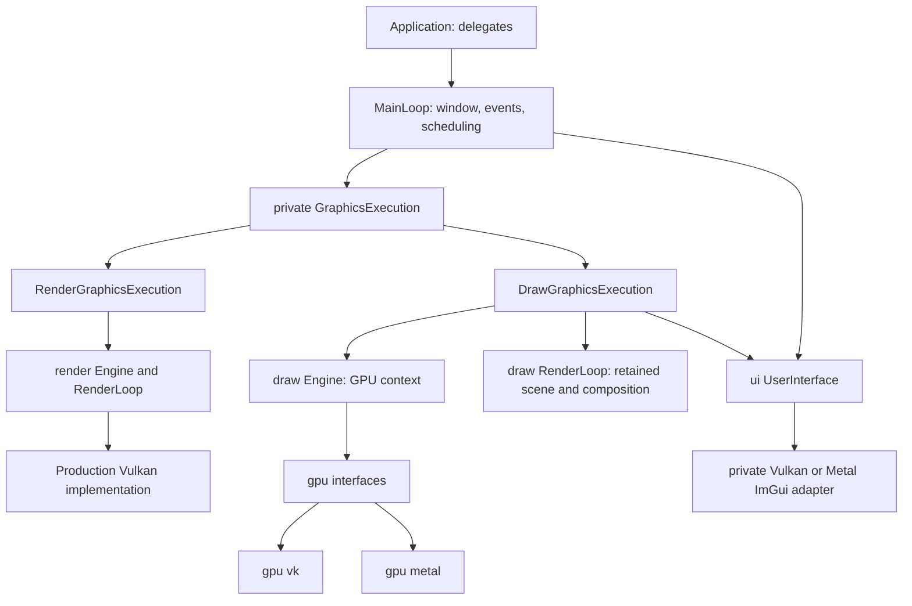

# MainLoop architecture: production render and experimental draw

MainLoop connects application delegates, window/event handling and graphics
execution in bg2 engine. This document explains the two high-level rendering
paths and their integration with the GPU abstraction and UI framework. Source
excerpts include file paths and line ranges; line numbers can shift as source
files evolve.

## Production and experimental frameworks

The terms **production** and **experimental** describe the maturity and scope of
bg2 engine's graphics APIs, not build configurations, deployment environments
or compiler optimization settings.

- **Production: `bg2e::render`.** This is the maintained framework used by the
  engine's applications. It provides Vulkan rendering and integrates with the
  production scene, material and UI components. Use it for applications that
  need those established high-level facilities. Production does not imply that
  an application must run on a server or use a Release build.
- **Experimental: `bg2e::draw`.** This is a high-level framework built on the
  backend-neutral `bg2e::gpu` API. Its windowed path supports Vulkan and Metal,
  retained scene color and separate UI composition. Its high-level scene and
  resource contracts have a narrower scope than render and can evolve as the
  API develops; render components cannot simply be passed to draw. Use it when
  evaluating the multi-backend architecture or building against its GPU-based
  delegate contract. Experimental does not mean the code is only a mock or that
  its window/UI path is unavailable.

Draw is intended to become the successor to render. Both APIs coexist; render
remains supported and is not deprecated. `bg2e::gpu` provides lower-level devices,
queues, commands and resources; it does not supply render's high-level scene
framework. Choosing Vulkan in draw does not select render.

## Responsibilities and API boundaries

`bg2e::app` is the application entry point; `bg2e::ui` provides widgets and UI
composition. Applications select a high-level framework through the run overload
and a low-level backend through EngineConfig. Render uses its own Vulkan device
implementation and waiting mechanism. Draw uses gpu interfaces, including their
submission registry. Draw's retained scene/resource model is independent of
render's frame resource model; it is not a one-to-one mapping of render classes.



## Public selection and delegate contracts

The application calls `init(argc, argv)` before `run`; MainLoop does not call it.
`run(Application*)` selects production on every platform, including
macOS. The explicit config overload selects draw, even if config selects Vulkan.
There is no default second argument and no backend fallback on failure.

Source: [lib/src/bg2e/app/MainLoop.cpp](../../lib/src/bg2e/app/MainLoop.cpp), lines 133–139. Exact excerpt:

```cpp
int32_t MainLoop::run(app::Application * application) {
    if (!application)
    {
        throw std::invalid_argument("MainLoop::run: application must not be null.");
    }
    return runInternal(application, detail::createRenderGraphicsExecution());
}
```

Source: [lib/src/bg2e/app/MainLoop.cpp](../../lib/src/bg2e/app/MainLoop.cpp), lines 141–147. Exact excerpt:

```cpp
int32_t MainLoop::run(app::Application * application, const draw::EngineConfig& config) {
    if (!application)
    {
        throw std::invalid_argument("MainLoop::run: application must not be null.");
    }
    return runInternal(application, detail::createDrawGraphicsExecution(config));
}
```

The default configuration prefers Metal on macOS and Vulkan elsewhere. Platform
macros come from PlatformTools; public draw contracts contain no Metal types.

Source: [lib/include/bg2e/draw/EngineConfig.hpp](../../lib/include/bg2e/draw/EngineConfig.hpp), lines 33–48. Exact excerpt:

```cpp
struct EngineConfig {
    // Prefer the native Metal backend on macOS; use Vulkan elsewhere.
#ifdef BG2E_IS_MAC
    gpu::BackendType backend = gpu::BackendType::Metal;
#else
    gpu::BackendType backend = gpu::BackendType::Vulkan;
#endif
    bool debug = false;

    // Empty by default: the MainLoop appId is used as the fallback.
    std::string applicationName = "";

    gpu::PixelFormat colorFormat = gpu::PixelFormat::B8G8R8A8_UNORM;
    gpu::PixelFormat depthFormat = gpu::PixelFormat::D32_SFLOAT;
};
```

Application stores separate render/draw delegate slots. Overloaded setters clear
the opposite slot, while `nullptr` clears both. Mutable getters can bypass that
invariant; adapter validation rejects opposite/both slots. The selected graphics
delegate, UI delegate and input delegate must all exist. Null application,
contract mismatch and Metal outside macOS are rejected before SDL/GPU allocation.
Draw's delegate does not inherit render::RenderLoopDelegate. It receives abstract GPU
commands, a retained color target and frame metadata; there is no Vulkan frame
resource or central descriptor initialization contract.

Source: [lib/include/bg2e/draw/RenderLoopDelegate.hpp](../../lib/include/bg2e/draw/RenderLoopDelegate.hpp), lines 33–52. Exact excerpt:

```cpp
class BG2E_API RenderLoopDelegate {
public:
    virtual ~RenderLoopDelegate() = default;

    virtual void init(Engine* engine) { _engine = engine; }

    virtual void initScene() {}

    virtual void resize(gpu::Size2D /* newExtent */) {}

    virtual void update(const FrameContext& /* frameContext */) {}

    virtual void render(const FrameContext& frameContext) = 0;

    virtual void cleanup() {}

protected:
    Engine* _engine = nullptr;
};
```

The UI delegate supplies distinct initialization overloads for
`render::Engine*` and `draw::Engine*`, each with a UserInterface pointer. Applications implement the selected
contract. It is not necessary to expose GraphicsExecution to users. See the
[complete example](../../examples/draw/01_window_ui/src/main.cpp) for argument
validation and delegate registration.

## Graphics execution strategies and shared responsibilities

The strategy is private to app's implementation. It owns the selected engine
and coordinator and abstracts only the hooks MainLoop needs. Factory functions
instantiate concrete strategies from run overloads. MainLoop
owns input routing, shortcuts, preferences, UserInterface, Loader, timeout
scheduler, window configuration, focus limits, resize debounce, safe updates
and queued main-thread work.

Source: [lib/src/bg2e/app/detail/GraphicsExecution.hpp](../../lib/src/bg2e/app/detail/GraphicsExecution.hpp), lines 46–88. Exact excerpt:

```cpp
class GraphicsExecution {
public:
    virtual ~GraphicsExecution() = default;

    virtual gpu::WindowType windowType() const = 0;
    virtual bool userInterfaceReady() const { return true; }

    // Inspects the configured delegates without allocating SDL/GPU resources.
    virtual void validate(const Application& application) const = 0;

    // Invoked after successful validation, before the SDL window is created.
    // Reports whether the selected runtime path is available.
    virtual void ensureRuntimeAvailable() const = 0;

    // Called after the runtime boundary and before SDL/window allocation.
    // Production execution needs no preparation.
    virtual void prepare(const std::string&) {}

    virtual void initialize(
        SDL_Window* window,
        Application& application,
        ui::UserInterface& userInterface
    ) = 0;

    virtual void initializeScene() = 0;

    // Records a resize request. The surface is not recreated during SDL
    // event dispatch.
    virtual void requestResize() = 0;

    // deltaMilliseconds keeps the production frame time unit.
    virtual void frame(float deltaMilliseconds, bool renderingAllowed) = 0;

    virtual void waitIdle() = 0;

    // Production scenes are continuously updated; draw overrides invalidation.
    virtual void requestSceneFrame() {}
    virtual void pauseScene(const glm::vec4& clearColor) = 0;
    virtual void resumeScene() = 0;

    virtual void cleanup() = 0;
};
```

`prepare` and scene invalidation default to no-ops for production. Draw overrides
preparation to acquire a backend lease and invalidation to mark the retained
scene dirty. `userInterfaceReady` guards event forwarding and loader overrides.
No delegate adaptation is attempted across the two scene contracts.

The start of runInternal shows validation and backend preparation order:

Source: [lib/src/bg2e/app/MainLoop.cpp](../../lib/src/bg2e/app/MainLoop.cpp), lines 149–153. Exact excerpt:

```cpp
int32_t MainLoop::runInternal(app::Application * application, std::unique_ptr<detail::GraphicsExecution> execution) {
    execution->validate(*application);
    execution->ensureRuntimeAvailable();
    execution->prepare(_appId);
```

Preparation creates a backend wrapper and retains it before window creation,
without initializing a native GPU instance. SDL window flags come from the
strategy's `windowType`. Window ownership is RAII; a local execution cleanup
guard releases established graphics stages before the SDL window during exception
unwinding. Normal shutdown explicitly waits/cleans/resets execution and then
releases the owned window. Destructors attempt cleanup without throwing; explicit
cleanup is the path for reporting errors.

## Render adapter: Vulkan rendering

RenderGraphicsExecution owns `render::Engine` and `render::RenderLoop`, initializes
production UI and installs its native Vulkan callback. Scene startup
initializes the production descriptor allocator. Frame timing is in
milliseconds. Resize debounce can suppress scene acquisition/presentation while
UI preparation continues.

Source: [lib/src/bg2e/app/detail/RenderGraphicsExecution.cpp](../../lib/src/bg2e/app/detail/RenderGraphicsExecution.cpp), lines 122–127. Exact excerpt:

```cpp
    void initializeScene() override
    {
        // Initialize the main descriptor set allocator before executing the first frame
        _engine.descriptorSetAllocator().initPool();
        _renderLoop.initScene();
    }
```

Source: [lib/src/bg2e/app/detail/RenderGraphicsExecution.cpp](../../lib/src/bg2e/app/detail/RenderGraphicsExecution.cpp), lines 137–152. Exact excerpt:

```cpp
    void frame(float deltaMilliseconds, bool renderingAllowed) override
    {
        if (renderingAllowed && _engine.newFrame())
        {
            _renderLoop.swapchainResized();
        }

        _renderLoop.setDelta(deltaMilliseconds);

        _userInterface->newFrame();

        if (renderingAllowed)
        {
            _renderLoop.acquireAndPresent();
        }
    }
```

Render cleanup proceeds through coordinator, UI cleanup request, UI callback removal,
then Engine cleanup. The production UI backend shutdown is registered with the
production Engine cleanup manager; its closure captures shared UI implementation
state so that it does not dereference a destroyed UserInterface wrapper.

## Draw Engine: context and ownership

DrawGraphicsExecution copies EngineConfig. Empty applicationName becomes the
MainLoop appId. `Factory::acquireBackend` atomically replaces/retains the global
backend under a mutex and rejects an existing external lease. Engine additionally
retains factory-owned backends; caller-owned backends remain borrowed. This
supports a controlled single shared-instance lifetime, not simultaneous active
engines for independent backends.

Source: [lib/src/bg2e/app/detail/DrawGraphicsExecution.cpp](../../lib/src/bg2e/app/detail/DrawGraphicsExecution.cpp), lines 97–102. Exact excerpt:

```cpp
    void prepare(const std::string& applicationId) override
    {
        if (_backend) return;
        if (_config.applicationName.empty()) _config.applicationName = applicationId;
        _backend = gpu::Factory::acquireBackend(_config.backend);
    }
```

Source: [lib/src/bg2e/draw/Engine.cpp](../../lib/src/bg2e/draw/Engine.cpp), lines 36–68. Exact excerpt:

```cpp
struct Engine::Impl {
    SDL_Window* window = nullptr;               // Non-owning
    std::shared_ptr<gpu::Backend> backendLease; // Pins factory-owned backends.
    gpu::Backend* backend = nullptr;            // Non-owning
    gpu::Instance* instance = nullptr;          // Non-owning (shared with Backend)
    std::unique_ptr<gpu::PhysicalDevice> physicalDevice;
    std::unique_ptr<gpu::Device> device;
    std::unique_ptr<gpu::WindowSurface> surface;
    std::unique_ptr<gpu::CleanupManager> cleanupManager;
    EngineConfig config;
    bool initialized = false;
    bool instanceCreationStarted = false;
    bool deviceCreationStarted = false;
    bool cleaning = false;

    void reset()
    {
        cleanupManager.reset();
        surface.reset();
        device.reset();
        physicalDevice.reset();
        instance = nullptr;
        backend = nullptr;
        backendLease.reset();
        instanceCreationStarted = false;
        deviceCreationStarted = false;
        cleaning = false;
        window = nullptr;
        config = EngineConfig{};
        initialized = false;
    }
};
```

Engine initialization checks window/backend compatibility and shared Instance
availability, configures name/debug, creates the Instance and WindowSurface,
chooses a suitable PhysicalDevice, and creates Device. Device::create also creates
the surface render target. Engine then creates CleanupManager and marks itself
initialized. The Instance wrapper belongs to Backend; Engine owns its initialized
lifetime and cleans it. Window/backend references are borrowed, with the optional
lease keeping a factory backend alive. Stage flags support rollback while
preserving the original initialization exception.

Source: [lib/src/bg2e/draw/Engine.cpp](../../lib/src/bg2e/draw/Engine.cpp), lines 79–128. Exact excerpt:

```cpp
void Engine::init(SDL_Window* window, gpu::Backend& backend, const EngineConfig& config)
{
    if (_impl->initialized || _impl->instanceCreationStarted || _impl->cleaning)
        throw std::logic_error("draw::Engine is already initialized or changing lifecycle state.");
    if (!window) throw std::invalid_argument("draw::Engine::init requires an SDL window.");
    if (backend.backendType() != config.backend)
        throw std::invalid_argument("draw::Engine backend does not match EngineConfig::backend.");

    try
    {
        _impl->backendLease = gpu::Factory::retainBackend(backend);
        _impl->window = window;
        _impl->backend = &backend;
        _impl->config = config;
        _impl->instance = backend.sharedInstance();
        if (!_impl->instance) throw std::runtime_error("Draw backend returned no Instance.");
        // The backend owns the wrapper; this Engine owns its initialized lifetime.
        // Do not overwrite an instance used by another context.
        if (_impl->instance->presentationMode() != gpu::PresentationMode::Undefined)
            throw std::logic_error("Draw backend shared Instance is already in use.");
        _impl->instanceCreationStarted = true;
        _impl->instance->setApplicationName(config.applicationName);
        _impl->instance->enableDebugMode(config.debug);
        _impl->instance->create(window);

        _impl->surface = backend.createWindowSurface(_impl->instance, config.colorFormat, config.depthFormat);
        if (!_impl->surface)
            throw std::runtime_error("Draw backend returned no WindowSurface.");
        _impl->physicalDevice = backend.createPhysicalDevice();
        if (!_impl->physicalDevice) throw std::runtime_error("Draw backend returned no PhysicalDevice.");
        _impl->physicalDevice->choose(*_impl->instance, *_impl->surface);
        if (!_impl->physicalDevice->isValid()) throw std::runtime_error("No suitable draw GPU device.");
        _impl->device = backend.createDevice();
        if (!_impl->device) throw std::runtime_error("Draw backend returned no Device.");
        _impl->deviceCreationStarted = true;
        // Device::create also creates the surface render target.
        _impl->device->create(_impl->instance, _impl->physicalDevice.get(), _impl->surface.get());
        if (!_impl->device->isValid()) throw std::runtime_error("Draw GPU Device creation failed.");
        // Vulkan surface validity includes its swapchain, created by Device.
        if (!_impl->surface->isValid()) throw std::runtime_error("Draw surface render target creation failed.");
        _impl->cleanupManager = std::make_unique<gpu::CleanupManager>(_impl->surface.get());
        _impl->initialized = true;
    }
    catch (...)
    {
        const auto error = std::current_exception();
        try { cleanup(); } catch (...) { /* Preserve the initialization failure. */ }
        std::rethrow_exception(error);
    }
}
```

## Draw adapter: delegate and UI assembly

The adapter initializes Engine, installs the draw delegate, initializes its
coordinator and UI, then supplies preparation/composition callbacks. Engine has
no UI ownership. Neither abstract gpu nor draw scene contracts require ImGui or
native Metal declarations.

Source: [lib/src/bg2e/app/detail/DrawGraphicsExecution.cpp](../../lib/src/bg2e/app/detail/DrawGraphicsExecution.cpp), lines 104–129. Exact excerpt:

```cpp
    void initialize(
        SDL_Window* window,
        Application& application,
        ui::UserInterface& userInterface
    ) override
    {
        if (!_backend) throw std::logic_error("Draw backend has not been prepared.");
        _engine.init(window, *_backend, _config);
        _engineInitialized = true;
        _userInterface = &userInterface;
        _renderLoop.setDelegate(application.drawDelegate());
        _renderLoop.init(&_engine);
        _lastDrawableSize = drawableSize();
        int width = 0, height = 0;
        SDL_GetWindowSize(window, &width, &height);
        application.uiDelegate()->setInitialSize(uint32_t(width), uint32_t(height));
        userInterface.setDelegate(application.uiDelegate());
        userInterface.init(&_engine);
        _uiInitialized = true;
        _renderLoop.setUIFramePreparationCallback([this](auto& command, auto& frame) {
            _userInterface->newFrame(command, frame);
        });
        _renderLoop.setUICompositionCallback([this](auto& command, auto& frame) {
            _userInterface->draw(command, frame);
        });
    }
```

Source: [lib/src/bg2e/app/detail/DrawGraphicsExecution.cpp](../../lib/src/bg2e/app/detail/DrawGraphicsExecution.cpp), lines 142–155. Exact excerpt:

```cpp
    void frame(float deltaMilliseconds, bool renderingAllowed) override
    {
        if (!renderingAllowed || !_engineInitialized) return;
        const auto size = drawableSize();
        if (size.isZero()) return;
        if (_resizePending || size != _lastDrawableSize)
        {
            _engine.surface()->resize(size);
            _renderLoop.requestResize();
            _lastDrawableSize = size;
            _resizePending = false;
        }
        _renderLoop.frame(deltaMilliseconds / 1000.0f);
    }
```

The adapter queries drawable pixel size using SDL_Metal_GetDrawableSize or
SDL_Vulkan_GetDrawableSize; logical SDL window dimensions are used for initial
UI viewport. Resize events mark pending work; positive drawable sizes trigger
surface recreation at the frame boundary. Zero sizes skip rendering. Surface
generation and the actually acquired image's dimensions/format drive downstream
scene and UI refresh, including backend-initiated swapchain recreation.
MainLoop keeps elapsed milliseconds; draw converts them to seconds.

## Retained scene, independent UI and frame slots

RenderLoop owns one persistent scene color image and per-in-flight-slot retained
command/frame wrappers. The scene image is shared across slots, not allocated
once per frame. Scene rendering and copies are on the same graphics queue;
Vulkan layout/access dependencies and Metal tracked hazards order GPU accesses.
This does not provide automatic cross-queue synchronization for objects using multiple queues.

Each positive available frame:

1. Acquire a presentation image and complete previous submissions occupying its
   resource slot; unavailable acquisition returns without advancing the slot.
2. Recreate retained color if size, format or generation changed (drain all
   users first), and notify the scene delegate of pixel extent.
3. Retain a fresh command/frame wrapper in the slot, begin recording and prepare UI.
4. If dirty and unpaused, call update, clear retained color, and invoke render.
   Initial/recreated color is cleared even while paused. The delegate closes its
   own rendering/compute scopes; the scene contract supplies no depth target.
5. Copy retained scene color to presentation color and compose UI as a separate
   color-only LOAD/STORE pass.
6. Record presentation, end recording, submit asynchronously, advance the
   surface slot/counter and poll deferred cleanup.

This excerpt is the concrete GPU submission tail, not pseudocode:

Source: [lib/src/bg2e/draw/RenderLoop.cpp](../../lib/src/bg2e/draw/RenderLoop.cpp), lines 152–165. Exact excerpt:

```cpp
    command.transition(_impl->sceneColor.get(), gpu::ImageLayout::TransferSrc);
    command.transition(presentationColor, gpu::ImageLayout::TransferDst);
    command.copyImage(_impl->sceneColor.get(), presentationColor);
    command.transition(presentationColor, gpu::ImageLayout::ColorAttachment);
    if (_uiComposition) _uiComposition(command, *frame);
    if (command.hasActiveScope()) throw std::logic_error("Draw UI composition left an active command scope.");
    command.transition(presentationColor, gpu::ImageLayout::Present);
    surface->present(&command);
    command.end();
    queue.submit(&command);
    _impl->colorInitialized = true;
    if (refresh && revision == _sceneRevision) _sceneDirty = false;
    surface->endFrame(frame.get());
    _engine->cleanupManager().flushDeferred();
```

The dirty revision is captured before scene callbacks. A request made during
scene/UI callbacks changes the revision, preventing the just-submitted frame
from clearing a newer request. The [FrameContext](../api/draw/FrameContext.md)
references are borrowed only for the callback; owning resources must not store
references to that transient context.

Consuming objects should hold persistent UBO/resource-set rings indexed by
`frameSlot`. Acquisition makes the reused slot safe before callbacks. Swapchain
image index, frame slot and monotonically increasing frame number are distinct.
There is no central create/destroy-per-frame descriptor phase. This does not
remove GPU synchronization requirements for shared or cross-queue resources.

## UI interoperability lives in ui

UserInterface selects the SDL platform backend and private renderer from
Engine::backendType. Shared implementation state stores the context, selected
renderer, initialized/prepared flags and borrowed draw Engine. New-frame and draw
calls require the same acquired command/frame pair. Only one current ImGui
context is supported. UI wrappers keep ImGui types out of public headers.

Vulkan UI uses gpu::vk native instance/device/queue handles, a UI-owned descriptor
pool and dynamic rendering configuration. Surface generation, count and format
changes refresh backend state; renderer recreation drains GPU users first.
`materializeRenderPass()` starts the GPU wrapper's lazy dynamic render pass
before the native ImGui draw call. Render UI uses its native callback API.


Source: [lib/src/bg2e/ui/ImGuiVulkanBackend.cpp](../../lib/src/bg2e/ui/ImGuiVulkanBackend.cpp), lines 130–140. Exact excerpt:

```cpp
    void draw(gpu::CommandBuffer& command, gpu::SurfaceFrame& frame) override
    {
        if (!_draw || !frame.isValid() || !frame.colorImage())
            throw std::logic_error("Draw UI requires a valid presentation target.");
        auto& vkCommand = require<gpu::vk::CommandBuffer>(&command, "UI commands must use Vulkan.");
        if (command.hasActiveScope()) throw std::logic_error("UI overlay requires closed scene scopes.");
        command.beginRendering(frame.colorImage()); // Color-only LOAD/STORE, no clear.
        vkCommand.materializeRenderPass();
        ImGui_ImplVulkan_RenderDrawData(ImGui::GetDrawData(), vkCommand.handle());
        command.endRendering();
    }
```

Metal UI uses guarded metal-cpp accessors in private source, derives a color-only
preparation descriptor from the acquired texture and caches generation/format/
sample count. Composition opens a distinct pass with no depth/stencil and LOAD/
STORE color actions. GPU owns the encoder and ends it once; UI borrows it:

Source: [lib/src/bg2e/ui/ImGuiMetalBackend.cpp](../../lib/src/bg2e/ui/ImGuiMetalBackend.cpp), lines 95–115. Exact excerpt:

```cpp
    void draw(gpu::CommandBuffer& command, gpu::SurfaceFrame& frame) override
    {
        auto* metalCommand = dynamic_cast<gpu::metal::CommandBuffer*>(&command);
        if (!_engine || !_preparation || !metalCommand || !frame.isValid() || !frame.colorImage())
            throw std::invalid_argument("Metal UI composition requires a prepared Metal frame.");
        if (command.hasActiveScope()) throw std::logic_error("Metal UI composition requires closed scene scopes.");
        {
            AutoreleaseScope autoreleaseScope;
            command.beginRendering(frame.colorImage()); // Color-only LOAD/STORE.
            auto* pass = metalCommand->renderPassDescriptor();
            auto* texture = pass->colorAttachments()->object(0)->texture();
            if (!texture || texture->pixelFormat() != _format || texture->sampleCount() != _sampleCount ||
                pass->depthAttachment()->texture() || pass->stencilAttachment()->texture())
                throw std::logic_error("Metal UI preparation and overlay pass configurations differ.");
            auto* encoder = metalCommand->materializeRenderEncoder();
            ImGui_ImplMetal_RenderDrawData(ImGui::GetDrawData(),
                metalCommand->handle(),
                encoder);
            command.endRendering(); // GPU owns and ends the encoder exactly once.
        }
    }
```

UI does not commit or present command buffers. `renderPassDescriptor()` and
`materializeRenderEncoder()` are guarded backend-only gpu hooks, without a gpu
dependency on ui. Metal framework types do not appear in portable draw/app
contracts. The vendored Objective-C++ ImGui backend is selected only on Apple
and compiled with ARC; its provenance/local compatibility patches are recorded
in [METAL_BACKEND_ORIGIN](../../lib/third_party/imgui/METAL_BACKEND_ORIGIN.md).
UI components using render scene/resources require that framework
and cannot automatically consume draw resources.

## Invalidation, pause and asynchronous work

`requestFrame()` is atomic/thread-safe and requests a presentation wakeup; it
does not invalidate draw's scene. `requestSceneFrame`, pause and resume are
main-thread operations during active run, forwarded through private execution.
A paused scene preserves last valid color while presentation/UI continue.
Requests stay pending until resume. Resize cannot preserve an obsolete-size
image, so a new target receives pause clear color.

Source: [lib/src/bg2e/app/MainLoop.cpp](../../lib/src/bg2e/app/MainLoop.cpp), lines 403–408. Exact excerpt:

```cpp
void MainLoop::requestSceneFrame()
{
    if (!_execution) throw std::logic_error("MainLoop::requestSceneFrame requires an active run.");
    _execution->requestSceneFrame();
    requestFrame();
}
```

Source: [lib/src/bg2e/app/MainLoop.cpp](../../lib/src/bg2e/app/MainLoop.cpp), lines 430–462. Exact excerpt:

```cpp
void MainLoop::executeSafeUpdateScene()
{
    std::vector<SafeUpdateSceneEntry> local;
    {
        std::lock_guard lock(_safeUpdateSceneMutex);
        if (_safeUpdateScene.empty()) return;
        std::swap(local, _safeUpdateScene);
    }
    // The execution exists only during an active run; outside a run there is
    // no GPU work in flight to wait for.
    if (_execution)
    {
        _execution->waitIdle();
    }
    bool updated = false;
    for (auto& entry : local)
    {
        if (!entry.hasToken)
        {
            entry.function();
            updated = true;
            continue;
        }

        auto token = entry.token.lock();
        if (token && token->alive->load())
        {
            entry.function();
            updated = true;
        }
    }
    if (updated && _execution) requestSceneFrame();
}
```

Safe-update enqueue is mutex-protected and requests a frame. At the main-thread
safe point it swaps the queue, waits through selected execution, skips expired
weak tokens, and invalidates draw only if callbacks ran. Token lifetime controls
cancellation; callbacks must respect object ownership and external GPU producers.
The wait is an intentional safe mutation boundary, not a per-frame wait.

Source: [lib/src/bg2e/app/MainLoop.cpp](../../lib/src/bg2e/app/MainLoop.cpp), lines 479–505. Exact excerpt:

```cpp
void MainLoop::asyncLoad(
    std::function<void(ui::Loader*)> loadFn,
    glm::vec4 clearColor,
    std::function<void(std::exception_ptr)> onComplete)
{
    if (!_execution)
    {
        throw std::logic_error("MainLoop::asyncLoad requires an active run; no graphics execution is available.");
    }

    _execution->pauseScene(clearColor);

    if (_execution->userInterfaceReady()) _userInterface.setFrameOverride([this]{ _loader.draw(); });

    std::thread([this, fn = std::move(loadFn), complete = std::move(onComplete)]() mutable
    {
        std::exception_ptr error;
        try { fn(&_loader); }
        catch (...) { error = std::current_exception(); }

        safeUpdateScene([this, complete = std::move(complete), error]() {
            if (_execution->userInterfaceReady()) _userInterface.clearFrameOverride();
            _execution->resumeScene();
            if (complete) complete(error);
        });
    }).detach();
}
```

Async loading pauses scene on the calling main thread, installs Loader frame
override if UI is ready, and runs loadFn on a detached worker. Completion,
including exception_ptr, is queued through safeUpdateScene; main-thread completion
clears override, resumes and invokes onComplete. The worker must not mutate
main-thread-only state. It must also finish before MainLoop destruction: current
code captures `this` in a detached thread and has no join/cancellation ownership.
Overlapping async loads/manual pause do not have nested ownership; completion
resumes unconditionally. These are current contracts/limitations, not guarantees
of an independent UI thread or concurrent scene mutation. The main thread must
remain available to process/present UI while expensive work runs elsewhere.

## Synchronization and shutdown

Ordinary draw submission is asynchronous; occupied slot reuse waits, not every
just-submitted frame. Device::waitIdle is a lifecycle/safe mutation barrier with
a shared submission admission gate. Metal drains retained command completions;
Vulkan calls vkDeviceWaitIdle inside the same gate and latches records. See
[the full GPU synchronization implementation](../api/gpu/Submission_tracking_and_waitIdle.md).
The gate reopens when waitIdle returns: callers stop producers through the entire
resource mutation/destruction interval. A native handle submission outside the
gpu Queue API is not tracked by the Metal registry.

Draw cleanup attempts all established stages and reports the first error:
coordinator/delegate and retained targets, UI while Device still lives, Engine
resources/surface/device/Instance, then backend lease. Engine's concrete cleanup
also handles partial initialization:

Source: [lib/src/bg2e/draw/Engine.cpp](../../lib/src/bg2e/draw/Engine.cpp), lines 130–158. Exact excerpt:

```cpp
void Engine::cleanup()
{
    if (_impl->cleaning) return;
    _impl->cleaning = true;
    std::exception_ptr error;
    const auto attempt = [&error](auto&& operation) {
        try { operation(); } catch (...) { if (!error) error = std::current_exception(); }
    };
    // Callers stop frame/background producers before entering this method and
    // keep them stopped: waitIdle's submission gate reopens on return.
    if (_impl->deviceCreationStarted && _impl->device->isValid())
        attempt([&] { _impl->device->waitIdle(); });
    if (_impl->cleanupManager)
    {
        attempt([&] { _impl->cleanupManager->flushAllDeferred(); });
        attempt([&] { _impl->cleanupManager->flush(); });
        _impl->cleanupManager.reset();
    }
    // Keep the device alive while surfaces release frame command wrappers,
    // depth targets, swapchain images and presentation synchronization.
    if (_impl->surface) attempt([&] { _impl->surface->cleanup(); });
    _impl->surface.reset();
    if (_impl->deviceCreationStarted) attempt([&] { _impl->device->cleanup(); });
    _impl->device.reset();
    _impl->physicalDevice.reset();
    if (_impl->instanceCreationStarted) attempt([&] { _impl->instance->cleanup(); });
    _impl->reset();
    if (error) std::rethrow_exception(error);
}
```

## Source map and API scope

| Responsibility | Primary source |
|---|---|
| Shared lifecycle and scheduling | `lib/src/bg2e/app/MainLoop.cpp` |
| Strategy interface / adapters | `lib/src/bg2e/app/detail/GraphicsExecution.hpp`, `RenderGraphicsExecution.cpp`, `DrawGraphicsExecution.cpp` |
| Context and leases | `lib/src/bg2e/draw/Engine.cpp`, `lib/src/bg2e/gpu/Factory.cpp` |
| Retained scene and composition | `lib/src/bg2e/draw/RenderLoop.cpp` |
| UI context and native adapters | `lib/src/bg2e/ui/UserInterface.cpp`, `ImGuiVulkanBackend.cpp`, `ImGuiMetalBackend.cpp` |
| Completion registry and frame reuse | `lib/include/bg2e/gpu/detail/SubmissionState.hpp`, `gpu/SurfaceFrame.hpp`, backend Queue/Surface sources |

Draw scene callbacks expose a color-only target. Render scene/material APIs and
UI components that consume those resources are separate contracts.
OffscreenApplication uses render. There is no automatic multi-context backend
management or UI thread. Multiple layers currently call waitIdle during cleanup
and resize (MainLoop, coordinator/UI, Engine/surface); these overlapping drains
are conservative lifecycle boundaries. They are not present after every ordinary submission.

See [app API](../api/app/index.md), [draw API](../api/draw/index.md),
[gpu API](../api/gpu/index.md) and the [example](../../examples/draw/README.md).
